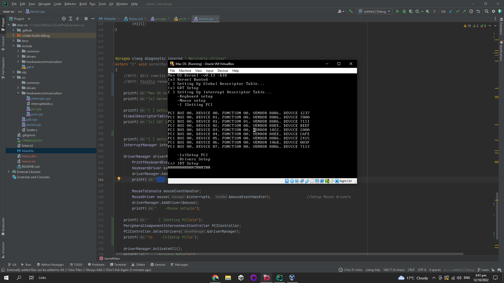

# Max Os

Max os following: [OS Dev Wiki](https://wiki.osdev.org/Creating_an_Operating_System), [YouTube WYOOS](https://www.youtube.com/watch?v=1rnA6wpF0o4&list=PLHh55M_Kq4OApWScZyPl5HhgsTJS9MZ6M&ab_channel=WriteyourownOperatingSystem')

Made mainly in C++ with a dabble of ASM. 

[](https://wakatime.com/badge/github/maxtyson123/max-os)


*Dont make pull request or bugs until initial is done (found in projects)
 
## Screenshots


### Services
-None Yet
### GUI Programs
-None Yet
### CLI Programs
-(COMING) Uinx / POSIX like 
### Libraries
-(COMING) Libc
-(COMING) Libm
### Ports
-(COMING) Doom

## Progress

###  Intial

Moved to  projects page


###  Extended

- [ ] Usable Desktop
- [ ] Applications
- [ ] Shell
- [ ] Libs
- [ ] POSIX
- [ ] Game Ports (DOOM etc..)
- [ ] Users 
- [ ] 64 Bit
- [ ] Game Engine
- [ ] Web Browser
- [ ] M++
- [ ] VNC


## Run Locally

Clone the project

```bash
  git clone https://github.com/maxtyson123/max-os
```

Go to the project directory

```bash
  cd max-os
```

Make Files and OS

```bash
 sudo apt-get install g++ binutils libc6-dev-i386 grub-legacy xorriso
 make maxOS.iso  
```

Run Os 

```bash
     Virtual Box
```


