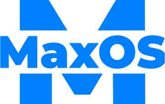

<!-- Improved compatibility of back to top link: See: https://github.com/maxtyson123/MaxOS/pull/73 -->
<a name="readme-top"></a>


<!-- PROJECT SHIELDS -->
<!--
*** I'm using markdown "reference style" links for readability.
*** Reference links are enclosed in brackets [ ] instead of parentheses ( ).
*** See the bottom of this document for the declaration of the reference variables
*** for contributors-url, forks-url, etc. This is an optional, concise syntax you may use.
*** https://www.markdownguide.org/basic-syntax/#reference-style-links
-->
[![Forks][forks-shield]][forks-url]
[![Stargazers][stars-shield]][stars-url]
[![Build][built-shield]][built-url]
[![Lines of Code][loc-shield]][loc-url]
[![wakatime][wakatime-shield]][wakatime-url]


<!-- PROJECT LOGO -->
<br />
<div align="center">
  <a href="https://github.com/maxtyson123/MaxOS">
    
  </a>

<h3 align="center">Max OS</h3>

  <p align="center">
    A 64bit hobby operating system written in C++
    <br />
    <a href="https://maxtyson123.github.io/MaxOS/html/"><strong>Explore the docs »</strong></a>
    <br />
    <br />
    <a href="https://github.com/maxtyson123/MaxOS">View Demo</a>
    ·
    <a href="https://github.com/maxtyson123/MaxOS/issues">Report Bug</a>
    ·
    <a href="https://github.com/maxtyson123/MaxOS/issues">Request Feature</a>
  </p>
</div>


<!-- TABLE OF CONTENTS -->
<details>
  <summary>Table of Contents</summary>
  <ol>
    <li>
      <a href="#about-the-project">About The Project</a>
    </li>
    <li>
      <a href="#getting-started">Getting Started</a>
      <ul>
        <li><a href="#prerequisites">Prerequisites</a></li>
        <li><a href="#installation">Installation</a></li>
      </ul>
    </li>
    <li><a href="#usage">Usage</a></li>
    <li><a href="#roadmap">Roadmap</a></li>
    <li><a href="#contributing">Contributing</a></li>
    <li><a href="#license">License</a></li>
    <li><a href="#acknowledgments">Acknowledgments</a></li>
  </ol>
</details>


<!-- ABOUT THE PROJECT -->

## About The Project

[![MaxOS][product-screenshot]](#)

Max OS is a hobby operating system developed for the 64bit platform using C++ and Assembly. The project is currently in
the early stages of development and is not yet ready for use. The project is being developed as a learning experience
and is not intended to be used as a production operating system.

Max OS supports device drivers, memory management, multitasking, a GUI, and more. The project is being developed with
the goal of being able to run on real hardware, however, it is currently only able to run on a virtual machine.

This GitHub repository contains the source code for the operating system, as well as the build scripts required to build
the operating system from source. The repository also contains the latest built kernel, which can be downloaded from the
workflow artifacts. To ensure a cleaner git history, each feature/change is done in a separate branch and then merged
into the main branch once working. To see the history of each feature press on the pull request number. If you are
intrested in the active development find the latest branch <a href="https://github.com/maxtyson123/MaxOS/branches">
Here</a>.

_Note:_ Ignore all the networking code & drivers, they are very outdated, badly written and will soon be ported over to
userspace and rewritten.
<p align="right">(<a href="#readme-top">back to top</a>)</p>

<!-- GETTING STARTED -->

## Getting Started

This is how to build the Max OS operating system from source. (Alternatively, you can download the latest built kernel
from the workflow artifacts)

Currently, Max OS can only be built on a linux-like machine, but does support WSL & Mac. If you are using WSL, make sure
the repo is on the WSL machine and not the Windows machine.

### Prerequisites

This is the list of required packages to build the operating system from source. (Note the build scripts should install
these automatically)

* build-essential
* bison
* flex
* libgmp3-dev
* libmpc-dev
* libmpfr-dev
* texinfo
* libisl-dev
* cmake
* telnet
* rsync

Linux:

  ```sh
  sudo apt update
  sudo apt install -y build-essential bison flex libgmp3-dev libmpc-dev libmpfr-dev texinfo libisl-dev cmake telnet
  ```

Mac:

```sh
  # Install Devtools (via Xcode or some other method)
  # Install Homebrew
  brew install coreutils bison gmp libmpc mpfr texinfo gcc@13 cmake nasm telnet
```

Note: If you want to run the operating system in a virtual machine, you will need to install QEMU. (If in WSL the script
will look for a Windows installation of QEMU)

### Installation

- Upon first build follow steps 1-5
- If you change the file structure (e.g. add a new file) follow steps 3-5
- If you're running on a new boot (e.g. you rebooted your computer) follow steps 4-5
- If you only change a file follow step 5

1. Clone the repo
   ```sh
   git clone https://github.com/maxtyson123/MaxOS.git
   cd MaxOS
   ```

2. Create the cross-compiler (This will take a while)
   ```sh
   cd toolchain
   ./make_cross_compiler.sh
   cd ../
   ```

3. Generate makefiles
   ```sh
   # If you edit the CMakeLists.txt file you will need to delete the build directory contents (not the folder) and regenerate the makefiles
   cd cmake-build
   
   # Change to -DCMAKE_BUILD_TYPE=Debug to enable debug mode
   cmake .. -DCMAKE_TOOLCHAIN_FILE=toolchain/CMakeToolchain.txt -DCMAKE_BUILD_TYPE=Release 
   ```

4. Clean the build directory
   ```sh
   make clean
   ```

5. Build the operating system & Run it in QEMU
   ```sh
   # Replace 'run' with 'gdb' on a debug build to make the kernel wait for gdb to attach on port 1234  
   make run
   ```

6. (OPTIONAL) I use CLion IDE for development, if you want to use it to follow these steps for IDE features:
    - Cmake
        - Open CLion
        - Select "Open or Import"
        - Select the `CMakeLists.txt` file in the root directory of the project
        - Make sure the profile is set to these settings:
            - CMake: `cmake .. -DCMAKE_TOOLCHAIN_FILE=toolchain/CMakeToolchain.txt`
            - Directory: `cmake-[release/debug]`
        - Click "OK"
        - Wait for CLion to index the project (this may take a while)
    - Code Style
        - Go to Settings -> Editor -> Code Styles -> (cog) -> Import Scheme -> C/C++ -> Import Scheme -> From
          `docs/Styles/ClionCodeStyleSettings.xml`
    - Debugger
        - Run a gdb build with `make gdb`
        - Create new configuration: Edit Configurations -> Add -> Remote Debugger
        -

<p align="right">(<a href="#readme-top">back to top</a>)</p>


<!-- USAGE EXAMPLES -->

## Usage

No user usage so far (userland will be added in the future)

#### Boot Console


#### GUI


<!-- ROADMAP -->

## Roadmap

#### Core Kernel

- [x] Bootloader
- [x] GDT
- [x] IDT
- [x] Interrupts
- [x] Keyboard & Mouse
- [x] PCI
- [x] ATA
- [x] VESA
- [x] Memory Management
- [x] Multitasking
- [x] GUI
- [x] Window Manager
- [x] Paging
- [x] Userspace
- [x] IPC
- [x] VFS
- [x] Loading ELF
- [x] Multiple Cores Support (SMP & Scheduler)
- [x] Move VFS & drivers to userspace
- [ ] Porting & Dynamically Linking Libc
- [ ] Move networking to userspace (& rewrite, fix)
- [ ] Clean up ALL Todos

#### Userland
- [ ] connect to Clion with SMB for files and GDB for debugging in userspace
- [ ] GUI
- [ ] Terminal
- [ ] DOOM Port
- [ ] Self-hosted os
- [ ] GUI Framework
- [ ] App Framework & System Apps
- [ ] Auto Updater & Image Builder (ISO Release)
- [ ] store
- [ ] Security of some sort
- [ ] User Switching
- [ ] Real Hardware Support
- [ ] Port NeoVim, Wakatime & Some hot reloader
- [ ] Create port of my 2048
- [ ] Own LibC

See the [open issues](https://github.com/maxtyson123/MaxOS/issues) for a full list of proposed features (and known
issues).

<p align="right">(<a href="#readme-top">back to top</a>)</p>


<!-- CONTRIBUTING -->

## Contributing

Contributions are what make the open source community such an amazing place to learn, inspire, and create. Any
contributions you make are **greatly appreciated**.

If you have a suggestion that would make this better, please fork the repo and create a pull request. You can also
simply open an issue with the tag "enhancement".
Don't forget to give the project a star! Thanks again!

1. Fork the Project
2. Create your Feature Branch (`git checkout -b feature/AmazingFeature`)
3. Commit your Changes (`git commit -m 'Add some AmazingFeature'`)
4. Push to the Branch (`git push origin feature/AmazingFeature`)
5. Open a Pull Request

<p align="right">(<a href="#readme-top">back to top</a>)</p>


<!-- LICENSE -->

## License

Distributed under the BSD 3-Clause License. See `LICENSE` for more information.

<p align="right">(<a href="#readme-top">back to top</a>)</p>


<!-- ACKNOWLEDGMENTS -->

## Acknowledgments

* [OSDev.org](https://wiki.osdev.org/)
* [WYOOS](http://wyoos.org/)
* [OSDev Notes](https://github.com/dreamportdev/Osdev-Notes/)
* [OSDev Subreddit](https://www.reddit.com/r/osdev/)
* [Duck OS](https://github.com/byteduck/duckOS)
* [Dream OS](https://github.com/dreamos82/Dreamos64)

<p align="right">(<a href="#readme-top">back to top</a>)</p>


<!-- MARKDOWN LINKS & IMAGES -->
<!-- https://www.markdownguide.org/basic-syntax/#reference-style-links -->

[product-screenshot]: docs/Screenshots/Boot/Console_v3.png

[contributors-shield]: https://img.shields.io/github/contributors/maxtyson123/MaxOS.svg?style=for-the-badge

[contributors-url]: https://github.com/maxtyson123/MaxOS/graphs/contributors

[forks-shield]: https://img.shields.io/github/forks/maxtyson123/MaxOS.svg?style=for-the-badge

[forks-url]: https://github.com/maxtyson123/MaxOS/network/members

[stars-shield]: https://img.shields.io/github/stars/maxtyson123/MaxOS.svg?style=for-the-badge

[stars-url]: https://github.com/maxtyson123/MaxOS/stargazers

[issues-shield]: https://img.shields.io/github/issues/maxtyson123/MaxOS.svg?style=for-the-badge

[issues-url]: https://github.com/maxtyson123/MaxOS/issues

[built-shield]: https://img.shields.io/github/actions/workflow/status/maxtyson123/MaxOS/max-os.yml?style=for-the-badge

[built-url]: https://github.com/maxtyson123/MaxOS/actions/workflows/max-os.yml

[loc-shield]: https://tokei.rs/b1/github/maxtyson123/MaxOS?style=for-the-badge

[loc-url]: https://github.com/maxtyson123/MaxOS

[wakatime-shield]: https://wakatime.com/badge/github/maxtyson123/MaxOS.svg?style=for-the-badge

[wakatime-url]: https://wakatime.com/badge/github/maxtyson123/MaxOS

